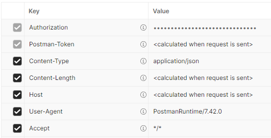

# SPR-GCE-HEADERS
In this example we will see how to get the headers from an HTTP request, and how to apply headers to HTTP responses.

If you clone this project and want to run it yourself, remember to get the maven dependencies after cloning with the CLI command: `mvn install`.

### Version Information
| Software       | Version |
|----------------|---------|
| SpringBoot     | 3.3.5   |
| Spring Web     | 6.1.14  |
| Java           | 21      |

## Headers
In HTTP, headers are metadata about the request or response in the form of key/value pairs. Request headers are part 
of the HTTP request, and response headers are part of the HTTP response sent back to the client. These headers describe 
important information about the request/response. For instance, a very common header is "Content-Type", which indicates 
the format of the body. "Content-Type" is the key, the name of the header. This header will often have values such as 
"application/json" or "text/plain".



*Screenshot from a Postman request. Here we can see the `Content-Type` header with a value of `application/json` along 
with several other headers.*

Sending headers in a request will help the server understand how to process that request. The server will send back 
headers in the response that help the client understand how to process that response. 

There are many well known headers that are part of standards, but we can also simply make our own. They're just 
key/value pairs of strings. 

## Reading Headers
In Spring Web we can get headers from the request in several ways. Each of the following examples can be found in the 
MyController class.

### @RequestHeader Annotation
Spring loves annotations, and there is almost always a way to do common things in Spring using annotations. One of the 
easiest ways to read a header in a Spring Web request handler is to use the @RequestHeader annotation in the parameter 
list. In the example below we ask Spring for the "Content-Type" header. If that header is present in the request, Spring 
will assign the value to the `contentType` String. If that key is not present, the value of `contentType` will be 
`null`.

```Java
public String readHeaderWithAnnotation(@RequestHeader("Content-Type") String contentType) {
    System.out.println(contentType);
    return contentType;
}
```

### Using the HttpServletRequest object
We can always ask Spring to give us an object representing the HTTP request. We simply add a parameter to our handler 
method of type `HttpServletRequest`. Spring will detect that parameter and understand it needs to pass the request 
object into our method. Once we have it, we can get the headers as well as any other part of the request from it. 

Here we will request the "Content-Type" header again by using its key name:

```Java
public String readHeaders(HttpServletRequest request) {
    String contentType = "Content-Type: " + request.getHeader("Content-Type");
    System.out.println(contentType);
    return contentType;
}
```

### Get All Headers
In both of the above examples, we knew the name (key) of the header we wanted. In the next example we will get all of 
the headers present in the request without knowing any of them ahead of time.

```Java
public String readAllHeaders(HttpServletRequest request) {
    //... we've ommitted some of this method. See MyController class for the whole thing.
    Enumeration<String> keys = request.getHeaderNames();
    while(keys.hasMoreElements()) {
        String key = keys.nextElement();
        String value = request.getHeader(key);
        //... 
    }
    //...
    return stringBuilder.toString();
}
```
We call `getHeaderNames()` to get the list of all the headers (the keys) and once we have those we can use them to
get each associated value one by one. `getAllHeaders()` returns an object of type `Enumeration`, which is very similar 
to the classes in the Java Collections API. This is a list of objects of some type (in this case Strings) we can 
process one at a time.

## Writing Headers
Next, let's consider how we add headers to a response. In the same way that request headers tell us about the request, 
response headers allow us to tell the client about our response. The methods we've seen above can be considered 
'getters', now we will be looking at 'setters'.

### Using HttpServetResponse
Earlier we used the `HttpServletRequest` object to get the request headers, next we will use an `HttpServletResponse` 
object to set them. This process is very similar and straightforward.

```Java
public String writeHeaders(HttpServletResponse response) {
    response.addHeader("Key-1", "Value 1");
    response.addHeader("Key-2", "Value 2");
    //...
    return "Check the response headers!";
}
```
Exactly like before with the request object, we tell Spring that we want the response object by including an object of 
type `HttpServletResponse` in the method parameter list. Spring provides the object, and then we can work with it. We 
simply call `setHeader()` and pass the key and the value. 

### Using ResponseEntity<>
Spring offers another class to work with, `ResponseEntity`. This class offers much of the same functionality as 
`HttpServletResponse`. Instead of having Spring provide the object to us, so we can work with it, we simply create it 
new and return it to Spring.

```Java
public ResponseEntity<String> writeHeadersWithResponseEntity() {
    HttpHeaders headers = new HttpHeaders();
    headers.add("Key-1", "Value 1");
    headers.add("Key-2", "Value 2");
    //...
    return new ResponseEntity<String>("Check the response headers!", headers, HttpStatus.OK);
}
```
In order to set headers on this `ResponseEntity` we create a new object of type `HttpHeaders` and call `add()` on it. 
Once we are done adding headers, we pass that object to a new `ResponseEntity` via a constructor. In this example we 
also set the body and the status code while we are at it.

Note that `ResponseEntity` is generic, and gets parameterized to a type. That is the type of the response body. In this 
case it's `String`, so the body of our response is a string.